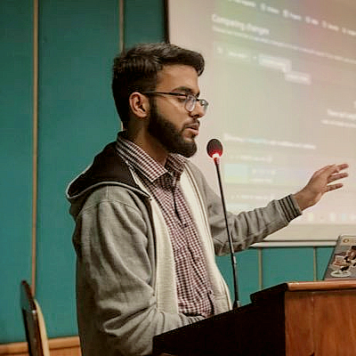

# Hi 👋, I'm Muhammad Umar Waseem 

[](https://wakatime.com/@ec57600d-1d86-47c7-a978-8435c3d0e65a)

### A software developer from `   PAKISTAN   ` &nbsp; &nbsp;  &nbsp;

<!--   -->

- 🖊️ I’m currently preparing for <a href= "https://learn.microsoft.com/en-us/certifications/exams/az-900" > ` Microsoft AZ-900 `  <a>
- 🎓 BS `Computer Science` student at <a href="http://isb.nu.edu.pk/" target="_blank" rel="noreferrer"> ` Fast National University Of Computer Sciences ` </a>
- 📧 Drop Me An <a href="mailto:umar.waseem@gmail.com" target="blank">`Email`</a> <br>
- 💻 I do freelance `Software Developement` on <a href = "https://www.upwork.com/freelancers/~0104077fe732576606" > ` Upwork ` <a>
- 🖋️ I write all sorts of articles on <a href = "https://medium.com/@umar.waseem" > ` Medium ` <a> 
- 🎥 I make videos on <a href = "https://youtube.com/@umar-waseem" > ` Youtube ` <a>

<h2 align="left">Socials: </h2>
<p align="left">
<a href="https://twitter.com/umarwaseeem" target="blank"></a>
<a href="https://linkedin.com/in/umarwaseeem" target="blank"></a>
<a href="https://stackoverflow.com/users/17903563" target="blank"></a>
<a href="https://instagram.com/umarwaseeem" target="blank"></a>
<a href="https://medium.com/@umarwaseeem" target="blank"></a>
<a href="https://youtube.com/@umarwaseeem" target="blank"></a>
</p>

<h2 align="left">Languages and Tools:</h2>
<p align="left"> <a href="https://developer.android.com" target="_blank" rel="noreferrer">  </a> <a href="https://developer.android.com" target="_blank" rel="noreferrer">  </a> <a href="https://azure.microsoft.com/en-in/" target="_blank" rel="noreferrer">  </a> <a href="https://getbootstrap.com" target="_blank" rel="noreferrer">  </a> <a href="https://www.cprogramming.com/" target="_blank" rel="noreferrer">  </a> <a href="https://www.w3schools.com/cpp/" target="_blank" rel="noreferrer">  </a> <a href="https://www.w3schools.com/css/" target="_blank" rel="noreferrer">  </a> <a href="https://dart.dev" target="_blank" rel="noreferrer">  </a> <a href="https://www.docker.com/" target="_blank" rel="noreferrer">  </a> <a href="https://expressjs.com" target="_blank" rel="noreferrer">  </a> <a href="https://firebase.google.com/" target="_blank" rel="noreferrer">  </a> <a href="https://flutter.dev" target="_blank" rel="noreferrer">  </a> <a href="https://git-scm.com/" target="_blank" rel="noreferrer">  </a> <a href="https://graphql.org" target="_blank" rel="noreferrer">  </a> <a href="https://developer.mozilla.org/en-US/docs/Web/JavaScript" target="_blank" rel="noreferrer">  </a> <a href="https://www.linux.org/" target="_blank" rel="noreferrer">  </a> <a href="https://www.mongodb.com/" target="_blank" rel="noreferrer">  </a> <a href="https://www.mysql.com/" target="_blank" rel="noreferrer">  </a> <a href="https://nodejs.org" target="_blank" rel="noreferrer">  </a> <a href="https://www.oracle.com/" target="_blank" rel="noreferrer">  </a> <a href="https://reactjs.org/" target="_blank" rel="noreferrer">  </a> <a href="https://tailwindcss.com/" target="_blank" rel="noreferrer">  </a> <a href="https://www.typescriptlang.org/" target="_blank" rel="noreferrer">  </a> </p>

## Check out some of my workshops / talks

<a href="https://www.youtube.com/watch?v=rBEi6s2x2ec" > Git is Lit – Version Control Workshop (Fast Nuces Islamabad, Pakistan) <a>

<a href="https://www.youtube.com/watch?v=WbU07nuFqxQ" >Study Jam By GDSC Fast Islamabad <a>
  
<a href="https://youtu.be/1v2oMY-3fk0?t=13822"> Google Developer Groups Live Pakistan (GDG LIVE PAKISTAN) <a>


## Check Out My Latest Articles 

- <a target="_blank" href="https://medium.com/@umarwaseeem/things-you-need-to-know-before-starting-flutter-af8c7639f7ab">What to do before learning Flutter?</a>
- <a target="_blank" href="https://medium.com/@umarwaseeem/hacktober-fest-once-again-98830f0ab7c9">Every Thing You Need To Know About Hacktober Fest 2022.</a>

<!--
### I code in :

&nbsp;&nbsp;&nbsp;&nbsp;&nbsp;&nbsp;&nbsp;
-->
## Github Stats 📈


## Contribution Streak


### Time spent on different languages in past 7 days:
<!--START_SECTION:waka-->

```txt
YAML              2 hrs 13 mins   ████████░░░░░░░░░░░░░░░░░   31.74 %
Dart              1 hr 52 mins    ██████▓░░░░░░░░░░░░░░░░░░   26.64 %
CocoaPods         52 mins         ███░░░░░░░░░░░░░░░░░░░░░░   12.32 %
XML               39 mins         ██▒░░░░░░░░░░░░░░░░░░░░░░   09.40 %
Groovy            33 mins         ██░░░░░░░░░░░░░░░░░░░░░░░   07.87 %
```

<!--END_SECTION:waka-->

  
  
  
  
  


